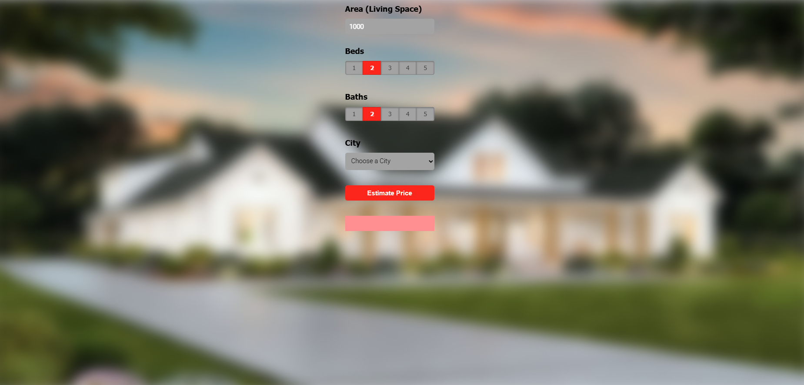

# 🏡 American House Price Prediction

## 📌 Opis projektu (Polski)
Projekt przewiduje ceny domów w USA na podstawie danych historycznych. Wykorzystuje popularne biblioteki do analizy danych i uczenia maszynowego.

### 📂 Struktura projektu
- `client/` - Interfejs użytkownika
- `server/` - Logika serwera i model predykcyjny
- `model/` - Zapisane modele uczenia maszynowego
- `README.md` - Opis projektu
- `screen.png` - Zrzut ekranu aplikacji

### 🖼️ Zrzut ekranu


### 📦 Używane biblioteki
- `pandas` 🐼 – manipulacja danymi
- `numpy` 🔢 – obliczenia numeryczne
- `matplotlib` 📊 – wizualizacja danych
- `sklearn` 🤖 – uczenie maszynowe
- `pickle` 🥒 – serializacja modeli

### 🚀 Uruchomienie
1. Sklonuj repozytorium:
   ```bash
   git clone https://github.com/user/American-House-Price-Prediction.git
   ```
2. Przejdź do folderu projektu:
   ```bash
   cd American-House-Price-Prediction
   ```
3. Uruchom aplikację:
   ```bash
   python server.py
   ```

---

## 🇺🇸 Project Description (English)
This project predicts house prices in the USA based on historical data. It uses popular libraries for data analysis and machine learning.

### 📂 Project Structure
- `client/` - User interface
- `server/` - Server logic and predictive model
- `model/` - Stored machine learning models
- `README.md` - Project description
- `screen.png` - Application screenshot

### 🖼️ Screenshot


### 📦 Used Libraries
- `pandas` 🐼 – data manipulation
- `numpy` 🔢 – numerical computations
- `matplotlib` 📊 – data visualization
- `sklearn` 🤖 – machine learning
- `pickle` 🥒 – model serialization

### 🚀 How to Run
1. Clone the repository:
   ```bash
   git clone https://github.com/user/American-House-Price-Prediction.git
   ```
2. Navigate to the project folder:
   ```bash
   cd American-House-Price-Prediction
   ```
3. Run the application:
   ```bash
   python server.py
   ```

📬 Jeśli masz pytania, skontaktuj się ze mną! / Feel free to contact me if you have any questions! 😊

